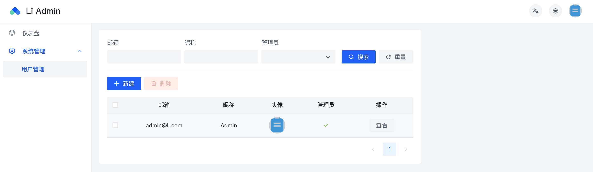
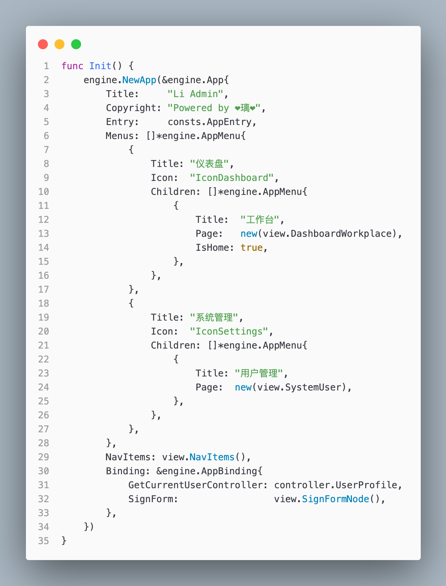

    <h1 align="center">❤️ LI ❤️</h1>

a next-generation low-code & fullstack app to create web services | 下一代 低代码&全栈类&为web服务 的应用开发框架（当前专注场景在后台系统）

---

## 🚀 简介
Li 是一个低代码 **全栈类** 的应用开发框架。她使用 **Go** 代码描述前端页面的 **Schema** , 基于图ORM框架 **ent** 的代码生成能力，只需要定义好数据表模型，在模型上添加上视图的注解，就能帮你自动生成完整的增删改查的 `Controller` & `View` & `AC<权限控制器>`，让你专注于业务开发。

代码生成并不是 Li 的核心能力，Li 专注于快速构建视图，处理复杂的 数据权限，操作权限，字段权限。

## 🌈 特性
+ **易于上手**：会基础的 Go 即可
+ **例子完整**：li-app 目录为真实的实战例子
+ **功能强大**：快速构建应用，灵活性高，能够处理复杂权限，加上代码生成加快业务开发
+ **大量组件**：支持后台管理系统的常见组件
+ **权限管理**：Li 具备完备的权限控制，能够同时控制视图的接口请求
+ **前端零代码**：前端页面按照开发者自定义的schema自动构建，无需处理前端代码

## 🧐 为什么要做 Li ?
* 1: 通用的应用构建存在大量的重复劳动
* 2: 基础的代码生成无法完美的服务于前端
* 3: 权限处理繁琐

为了解决上面这些问题，**Li** 诞生了，她很年幼却很强大，而且目标很远大。

## 📟 技术体系
**后端：**
Golang, GoFrame, Ent ...

**前端：**
 React, TypeScript, Formily, Arco-Design ...

 ## 🏗️ 本地开发
 * 1: cd li-web & pnpm
 * 2: cd li-web/apps/admin & pnpm dev
 * 3: cd li-app, 配置 config.yaml, make generate & make migrate
 * 4: 创建管理员账号：go run li.go user-create -u=你的邮箱 -p=你的密码
 * 5: 浏览器打开 localhost:3000
 * 6: Just for fun~~~

## ⛰ 演示截图
<table>
    <tr>
        <td colspan="2"></td>
        <td colspan="2"></td>
    </tr>
</table>

---

作者 Bean.Wei / vx: zlnwcq

 